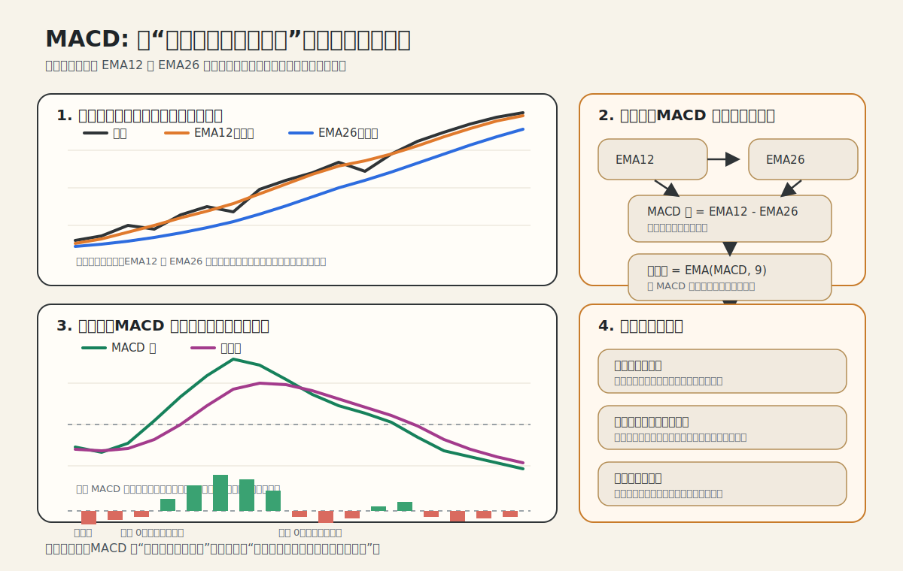

# 趋势信号原理详解

## 核心思想

所有趋势信号都在回答同一个问题：**价格在涨还是在跌？趋势有多强？**

但它们用不同的方式来回答，各有优劣。可以分成四大类：

```
动量类 ── 直接看价格变化（涨了就做多）
均线类 ── 用平滑后的价格判断方向（去噪音）
通道类 ── 看价格是否突破了历史区间
回归类 ── 用数学拟合来度量趋势
```

---

## 一、动量类

### 1. Momentum（时间序列动量）

**一句话**：过去 N 天涨了就做多，跌了就做空。

**计算**：
```
信号 = sign(今天的价格 / N天前的价格 - 1)
```

**直觉**：这是最朴素的趋势信号——如果一个东西过去在涨，赌它继续涨。

**优点**：简单、直接、不需要调太多参数。
**缺点**：只看起点和终点，忽略中间的路径。如果过去 20 天先涨后跌但净变化为正，它会说"做多"，但趋势可能已经反转了。

**参数**：`lookback` — 回看天数。短（5-10天）= 快速反应但噪音多；长（60-120天）= 稳定但反应慢。

---

### 2. Combined Momentum（多周期动量）

**一句话**：同时看短期、中期、长期动量，投票决定方向。

**计算**：
```
信号 = mean(momentum_12天, momentum_30天, momentum_60天)
```

**直觉**：单一周期的动量可能被噪音干扰。如果短中长期都看多，更可能是真趋势；如果短期看多但长期看空，说明趋势不一致，应该减仓。

**输出范围 [-1, +1]**：
- +1.0 = 三个周期都看多（强趋势共识）
- +0.33 = 两个看多一个看空（弱共识）
- 0 = 完全分歧

**这是你代码里唯一一个"原生连续值"的信号**，其他信号在项目二中做了归一化升级。

---

### 3. MACD（Moving Average Convergence Divergence）

**一句话**：快慢均线之间的距离在扩大还是缩小。



**先看图怎么读**：
- 上半部分先看价格、EMA12、EMA26。价格拐头向上时，快线先动，慢线后动，所以两条线的距离会先扩大。
- 中间公式链说明了 MACD 的三层结构：`快慢均线之差 -> 这个差的平滑值 -> 两者再做差`。
- 下半部分最关键：MACD 线告诉你方向，柱状图告诉你“方向变化是不是在加速”。

**计算**：
```
MACD线 = EMA(12天) - EMA(26天)        ← 快慢均线的差
信号线 = EMA(MACD线, 9天)              ← MACD线本身的均线
柱状图 = MACD线 - 信号线               ← 差值的差值
```

**把公式完全展开**：
```
EMA_t = α × Price_t + (1 - α) × EMA_{t-1}
其中 α = 2 / (N + 1)

所以：
EMA12_t = (2/13) × Price_t + (11/13) × EMA12_{t-1}
EMA26_t = (2/27) × Price_t + (25/27) × EMA26_{t-1}

MACD_t = EMA12_t - EMA26_t

Signal_t = (2/10) × MACD_t + (8/10) × Signal_{t-1}
         = 0.2 × MACD_t + 0.8 × Signal_{t-1}

Histogram_t = MACD_t - Signal_t
```

**这串公式怎么理解**：
- `EMA12` 给今天价格更高权重，所以反应更快。
- `EMA26` 给历史更高权重，所以更平滑、更慢。
- `MACD = EMA12 - EMA26`，表示短期趋势相对长期趋势领先了多少。
- `Signal` 是 `MACD` 自己的 9 日 EMA，相当于给动能再做一次平滑。
- `Histogram` 则是在看：当前动能相对“平滑后的平均动能”是更强还是更弱。

**初始化怎么做**：
- 实现里常见两种方法：第一天直接令 `EMA_1 = Price_1`，或者先用前 `N` 天的简单平均作为第一个 EMA。
- 只要样本足够长，前几天初始化的差异通常会很快衰减掉。

**直觉**：

想象两条均线。当价格开始上涨时，快均线先涨，慢均线后涨，两条线的距离（MACD线）开始扩大。柱状图衡量的是这个"扩大的速度"——

- 柱状图从负变正 = 趋势正在从下跌转为上涨（加速阶段）
- 柱状图虽然为正但在缩小 = 上涨趋势在减弱

**为什么用柱状图而不是 MACD 线？** MACD 线是滞后的（均线本来就滞后），柱状图是"滞后的导数"，能更早反映趋势变化。

**归一化方法**：用滚动标准差归一化到 [-1, +1]，因为不同品种的价格尺度不同。

**在我们的数据上 MACD 亏钱**：可能是默认参数（12/26/9）不适合日线级别的期货。这些参数最初是为股票设计的。

---

## 二、均线类

### 4. MA Crossover（SMA 交叉）

**一句话**：快均线在慢均线上方就做多。

**计算**：
```
快均线 = SMA(10天)
慢均线 = SMA(50天)
信号 = sign(快均线 - 慢均线)
```

**直觉**：均线 = 过去 N 天价格的平均值。短期均线代表"近期趋势"，长期均线代表"长期趋势"。当短期趋势超过长期趋势（快线上穿慢线），说明价格在加速上涨。

**SMA 的问题**：Simple Moving Average 对所有历史数据赋予相同权重。10天前的价格和今天的价格同等重要，这不太合理。

---

### 5. EMA Crossover（EMA 交叉）

**一句话**：和 SMA 交叉一样，但用指数均线，对近期价格更敏感。

**EMA vs SMA 的区别**：

```
SMA(10) = (P1 + P2 + ... + P10) / 10     ← 每天权重相同
EMA(10) = 近期价格权重高，远期权重指数衰减  ← 今天最重要，10天前几乎不算
```

EMA 的权重衰减公式：`α = 2/(N+1)`，每天的权重是前一天的 `(1-α)` 倍。

**优点**：对新信息反应更快，信号更及时。
**缺点**：也更容易被短期噪音误导。

**连续值输出**：EMA 交叉版本不只输出 +1/-1，而是输出快慢线之差的归一化值，差距越大 = 信号越强。

---

## 三、通道突破类

### 6. Donchian Breakout（Donchian 通道突破）

**一句话**：价格创 N 日新高就做多，创新低就做空。

**计算**：
```
上轨 = 过去 N 天最高价
下轨 = 过去 N 天最低价
信号 = (当前价格在通道中的位置) × 2 - 1
```

**直觉**：这是 Richard Dennis 的"海龟交易法则"用的核心信号。逻辑很简单——如果价格突破了过去 20 天的最高点，说明市场正在做一些"不寻常"的事情，可能是新趋势的开始。

**连续值的含义**：
- +1 = 价格在通道顶部（20日新高）
- 0 = 价格在通道中间
- -1 = 价格在通道底部（20日新低）

**和动量的区别**：动量只看起点和终点，Donchian 看的是极值。如果价格从 100 涨到 110 再跌到 105，动量说"做多"（105 > 100），但 Donchian 可能说"中性"（105 在 100-110 的中间）。

---

### 7. Bollinger Breakout（布林带突破）

**一句话**：价格偏离均值超过 2 个标准差就认为有趋势。

**计算**：
```
中轨 = SMA(20天)
上轨 = 中轨 + 2 × 标准差(20天)
下轨 = 中轨 - 2 × 标准差(20天)
信号 = 价格在带中的相对位置，映射到 [-1, +1]
```

**直觉**：布林带会根据市场波动率自动调整宽度。波动小的时候带变窄，波动大的时候带变宽。

- 价格触及上轨 = 相对于近期波动，价格涨得"异常多"
- 价格在中轨 = 正常范围
- 价格触及下轨 = 跌得"异常多"

**和 Donchian 的区别**：Donchian 用最高/最低价定义通道（固定形状），布林带用标准差（自适应宽度）。在低波动期，布林带的通道比 Donchian 窄，更容易触发突破信号。

---

### 8. Keltner Breakout（Keltner 通道）

**一句话**：和布林带类似，但用 ATR（平均真实波幅）代替标准差来定义通道宽度。

**计算**：
```
中轨 = EMA(20天)
ATR  = 过去20天的平均真实波幅
上轨 = 中轨 + 2 × ATR
下轨 = 中轨 - 2 × ATR
```

**ATR 是什么？** True Range = max(当日最高-最低, |最高-昨收|, |最低-昨收|)。它衡量的是每天价格实际波动的幅度，比收盘价的标准差更能捕捉日内波动。

**布林带 vs Keltner 的区别**：
- 布林带用收盘价标准差 → 只看收盘价的波动
- Keltner 用 ATR → 考虑了日内的高低波动和跳空缺口
- 实际效果：Keltner 通道通常更平滑，不会因为单日大涨/大跌就剧烈收缩或扩张

---

## 四、回归类

### 9. Linear Regression Slope（线性回归斜率）

**一句话**：在过去 N 天的价格上画一条"最佳拟合直线"，斜率为正就做多。

**计算**：
```
对过去 30 天的价格做线性回归 y = a + b×t
斜率 b > 0 → 上升趋势
斜率 b < 0 → 下降趋势
用 R² 加权 → R² 高说明价格走得很"直"，趋势可信
```

**R² 是什么？** 决定系数，衡量"价格变化中有多少比例可以被线性趋势解释"。

- R² = 1.0：价格完美地沿直线运动（纯趋势）
- R² = 0.5：一半趋势一半噪音
- R² = 0.0：完全随机，没有趋势

**信号 = 斜率 × R²** 的含义：斜率大但 R² 低 = 虽然总体在涨，但过程很曲折（不可信）。斜率小但 R² 高 = 虽然涨幅不大，但走得很稳定（可信）。

**和动量的区别**：动量只看起点终点，线性回归考虑了中间的路径质量。

---

## 五、趋势强度类

### 10. ADX/DMI（Average Directional Index）

**一句话**：先判断趋势方向（+DI vs -DI），再用 ADX 衡量趋势有多强。

**计算（分三步）**：

**Step 1 — 方向运动 (Directional Movement)**：
```
+DM = 今日最高 - 昨日最高（如果 > 0 且 > 下跌幅度）
-DM = 昨日最低 - 今日最低（如果 > 0 且 > 上涨幅度）
```
核心思想：哪个方向的突破更大，就算哪个方向的运动。

**Step 2 — 方向指标 (Directional Indicator)**：
```
+DI = +DM 的平滑值 / ATR    ← 上涨方向运动占总波动的比例
-DI = -DM 的平滑值 / ATR    ← 下跌方向运动占总波动的比例
```
+DI > -DI → 多头主导，反之空头主导。

**Step 3 — ADX（趋势强度）**：
```
DX = |+DI - -DI| / (+DI + -DI)   ← 多空力量差距有多大
ADX = DX 的平滑值               ← 消除噪音
```
ADX 高（>25）= 有明确趋势；ADX 低（<20）= 震荡市。

**最终信号 = 方向(+1/-1) × ADX归一化(0~1)**

**独特之处**：ADX 是唯一一个区分"方向"和"强度"的信号。其他信号把方向和强度混在一起，ADX 分开处理。这意味着在震荡市场，即使 +DI > -DI，ADX 也会很低，信号接近 0 → 自动减仓。

---

## 信号对比总结

| 信号 | 看什么 | 反应速度 | 抗噪音 | 特点 |
|------|--------|---------|--------|------|
| momentum | 起点-终点价差 | 取决于lookback | 低 | 最简单 |
| combined_momentum | 多周期投票 | 中等 | 中 | 内置多周期确认 |
| macd | 均线差的加速度 | 快 | 中 | 领先信号但参数敏感 |
| ma_crossover | SMA交叉 | 慢 | 高 | 经典稳健 |
| ema_crossover | EMA交叉 | 中 | 中 | SMA的快速版 |
| donchian | N日新高/新低 | 取决于period | 高 | 海龟法则 |
| bollinger | 相对波动率位置 | 中 | 中 | 自适应通道 |
| keltner | ATR通道位置 | 中 | 高 | 更平滑的通道 |
| linreg | 趋势斜率+线性度 | 慢 | 高 | 最数学化，有R²置信度 |
| adx | 方向运动强度 | 慢 | 高 | 自动在震荡期减仓 |

## 为什么它们高度相关？

从相关性矩阵看到这 10 个信号的相关性在 0.5-0.9 之间，这不意外：

**它们都在度量同一个东西** — 价格趋势。只是度量方式不同（就像温度计可以用水银、红外、热电偶，但测的都是温度）。在强趋势期间，所有信号都会给出相同的方向；区别主要在趋势的开始和结束阶段，不同信号的反应时间不同。

真正的分散化需要来自**不同类型的因子**（比如项目五的 carry、价值因子），而不是同一类因子的不同实现。
